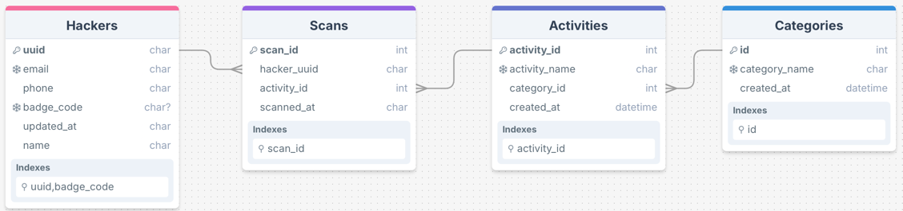

# Hack the North 2025 Backend Challenge
___
## Setting Up
To start the backend, simply have Docker open and run `docker compose up` in the root. This will start up the service on `http://127.0.0.1:3000/graphql`.

Running it locally without Docker is  also possible. Create a virtual environment (Python 3.11), set `HackTheNorthBE` as the source root, run `pip3 install -r requirements.txt`, and then run `python3 main.py`. This will start the service under `http://127.0.0.1:5000/graphql`.
___
## Data
All data is already seeded into the SQL server. This is seeded when the service begins running, and all data is wiped out when the service is closed.

___
## Important Decisions
I had to make a couple of important decisions regarding the database schema and the endpoints. This is my reasoning and I really hope I didn't troll.
- The main choice was using a type 4 uuid as the primary key for the hackers database rather than the email or the badge code. 
  - This was because I think the email and badge code can change. For example, maybe the user wants to update their email, or they lost their badge and need a new one. 
  - I think it makes more sense to bind scans to the actual user, rather than something that change as like email and badge code.
- When running queries where we need an identify the user, I flip-flop between using the UUID and the badge code. This is based off what I think makes sense depending on the context. For example, when updating the user, it makes sense that they do it from their account, and so `uuid` is passed as the parameter. However, when querying for user information I chose to use the badge code to identify the user. This is because I am assuming that this endpoint is used for an organizer to scan someone's badge for their information, or for hackers to scan eachother's badges for their information (and also why it being null won't matter). I remember the year I went scanning the badges bought us to like a linktree page.
- I am assuming that the hackers database starts off with all registered event attendees.
  - From the problem statement, it seems that users have pre-registered for the event with information like email and name.
  - When they come check in, they will be assigned a badge code. When they check out we will remove the badge code. It also makes sense for them to be able to get a new badge, in the event that they lost it. These are an extra set of endpoints for this functionality.
- The activities and categories are kept as reference tables. There is a tradeoff since we are adding scans much more than we are adding activities or categories, but I wanted to be safe since there was no guarantee for what type the activity name or category would come in.
  - Could also be better for renaming. For example, maybe we want to archive an activity from 2022 to add a new one in 2023 by changing the name, but still have it show up in user records. This way we have a easy way to change them.
- For the scan data endpoint, another possibility was keeping track of the number of scans in the activity database. I decided against this as we scan much more than we will query number of scans, meaning that on each scan we are doing much more work as we have to update the count in the activity table as well.
___
## API
### All Users Endpoint
```graphql
# GraphQL Query
query {
  hackers {
    uuid
    name
    email
    phone
    badgeCode
    updatedAt
    scans {
      activityName
      activityCategory
      scannedAt
    }
  }
}

```
```graphql
# Response
{
  "data": {
    "hackers": [
      {
        "uuid": "String",
        "name": "String",
        "email": "String",
        "phone": "String",
        "badgeCode": "String",
        "updatedAt": "String",
        "scans": [
          {
            "activityName": "String",
            "activityCategory": "String",
            "scannedAt": "String"
          },
          ...
        ]
      },
      ...
    ]
  }
}
```

### User Information Endpoint
```graphql
# GraphQL Query
query {
  hackersByBadge(badgeCode: "badge_code") {
    uuid
    name
    email
    phone
    badgeCode
    updatedAt
    scans {
      activityName
      activityCategory
      scannedAt
    }
  }
}
```
| Field     | Type   | Required | Description                |
|-----------|--------|----------|----------------------------|
| badgeCode | String | Yes      | The badge code of the user |
```graphql
# Response
{
  "data": {
    "hackersByBadge": {
      "uuid": "String",
      "name": "String",
      "email": "String",
      "phone": "String",
      "badgeCode": "badge_code",
      "updatedAt": "String",
      "scans": [
        {
          "activityName": "String",
          "activityCategory": "String",
          "scannedAt": "String"
        },
        ...
      ]
    }
  }
}
```
### Updating User Data Endpoint
```graphql
# GraphQL Mutation
mutation {
  updateHacker(uuid: "uuid", data: {name: "new_name", email: "new_email", phone: "new_phone"}) {
    hacker {
      uuid
      name
      email
      phone
      badgeCode
      updatedAt
      scans {
        activityName
        activityCategory
        scannedAt
      }
    }
  }
}
```
| Field | Type   | Required | Description                                                                            |
|-------|--------|----------|----------------------------------------------------------------------------------------|
| uuid  | String | Yes      | The UUID of the user                                                                   |
| data  | json   | Yes      | Can contain the name, email, and phone we want to update to. All of these are optional |
```graphql
# Response
{
  "data": {
    "updateHacker": {
      "hacker": {
        "uuid": "uuid",
        "name": "new_name",
        "email": "new_email",
        "phone": "new_phone",
        "badgeCode": "String",
        "updatedAt": "new_timestamp",
        "scans": [
          {
            "activityName": "String",
            "activityCategory": "String",
            "scannedAt": "String"
          },
          ...
        ]
      }
    }
  }
}
```
### Add Scan Endpoint
```graphql
# GraphQL Mutation
mutation {
  scanHacker(badgeCode: "badge_code", activityName: "activity_name", activityCategory: "activity_category"){
    hacker {
      uuid
      name
      email
      phone
      badgeCode
      updatedAt
      scans {
        activityName
        activityCategory
        scannedAt
      }
    }
  }
}
```
| Field            | Type   | Required | Description                                       |
|------------------|--------|----------|---------------------------------------------------|
| badgeCode        | String | Yes      | The badge code of the hacker                      |
| activityName     | String | Yes      | The name of the activity we are scanning into     |
| activityCategory | String | Yes      | The category of the activity we are scanning into |
```graphql
# Response
{
  "data": {
    "scanHacker": {
      "hacker": {
        "uuid": "String",
        "name": "String",
        "email": "String",
        "phone": "String",
        "badgeCode": "badge_code",
        "updatedAt": "new_timestamp",
        "scans": [
          {
            "activityName": "String",
            "activityCategory": "String",
            "scannedAt": "String"
          },
          ...
          {
            "activityName": "activity_name",
            "activityCategory": "activity_category",
            "scannedAt": "new_timestamp"
          },
        ]
      }
    }
  }
}
```
### Scan Data Endpoint
```graphql
# GraphQl Query
query {
  scans(minFrequency: int, maxFrequency: int, activityCategory: "activity_category") {
    activityName
    frequency 
  } 
} 
```
| Field            | Type    | Required | Description                                         |
|------------------|---------|----------|-----------------------------------------------------|
| minFrequency     | Integer | No       | Display the activities with at least this much scans |
| activityName     | Integer | No       | Display the activities with at most this much scans |
| activityCategory | String  | No       | Filter all activities that are not in this category |
```graphql
# Response
{
  "data": {
    "scans": [
      {
        "activityName": "String",
        "frequency": Integer
      },
      ...
    ]
  }
}
```
### Check In User Endpoint
```graphql
# GraphQL Query
mutation {
  checkHackerIn(uuid:"uuid", badgeCode:"new_badgecode") {
    hacker {
      uuid
      name
      email
      phone
      badgeCode
      updatedAt
      scans {
        activityName
        activityCategory
        scannedAt
      }
    }
  }
}
```
| Field            | Type   | Required | Description                                |
|------------------|--------|----------|--------------------------------------------|
| uuid             | String | Yes      | UUID of the hacker we want to check in.    |
| badgeCode        | String | Yes      | Badge code that we want to assign to them. |
```graphql
# Response
{
  "data": {
    "checkHackerIn": {
      "hacker": {
        "uuid": "uuid",
        "name": "String",
        "email": "String",
        "phone": "String",
        "badgeCode": "new_badgecode",
        "updatedAt": "new_timestamp",
        "scans": [
          {
            "activityName": "String",
            "activityCategory": "String",
            "scannedAt": "String"
          },
          ...
        ]
      }
    }
  }
}
```
### Update Badge Endpoint
```graphql
# GraphQL Query
mutation {
  checkHackerIn(uuid:"uuid", badgeCode:"new_badgecode") {
    hacker {
      uuid
      name
      email
      phone
      badgeCode
      updatedAt
      scans {
        activityName
        activityCategory
        scannedAt
      }
    }
  }
}
```
| Field            | Type   | Required | Description                                           |
|------------------|--------|----------|-------------------------------------------------------|
| uuid             | String | Yes      | UUID of the hacker we want to assign a new badge for. |
| badgeCode        | String | Yes      | Badge code that we want to assign to them.            |
```graphql
# Response
{
  "data": {
    "checkHackerIn": {
      "hacker": {
        "uuid": "uuid",
        "name": "String",
        "email": "String",
        "phone": "String",
        "badgeCode": "new_badgecode",
        "updatedAt": "new_timestamp",
        "scans": [
          {
            "activityName": "String",
            "activityCategory": "String",
            "scannedAt": "String"
          },
          ...
        ]
      }
    }
  }
}
```
### Check User Out Endpoint
```graphql
# GraphQL Mutation
mutation {
  checkHackerOut(badgeCode:"badge_code") {
    hacker {
      uuid
      name
      email
      phone
      badgeCode
      updatedAt
      scans {
        activityName
        activityCategory
        scannedAt
      }
    }
  }
}
```
| Field            | Type   | Required | Description                                    |
|------------------|--------|----------|------------------------------------------------|
| badgeCode        | String | Yes      | Badge code of the hacker we want to check out. |
```graphql
# Response
{
  "data": {
    "checkHackerOut": {
      "hacker": {
        "uuid": "String",
        "name": "String",
        "email": "String",
        "phone": "String",
        "badgeCode": null,
        "updatedAt": "new_timestamp",
        "scans": [
          {
            "activityName": "String",
            "activityCategory": "String",
            "scannedAt": "String"
          },
          ...
        ]
      }
    }
  }
}
```
___
## Additional Notes:
Besides the boilerplate provided code, I also used SQLAlchemy for my ORM.
